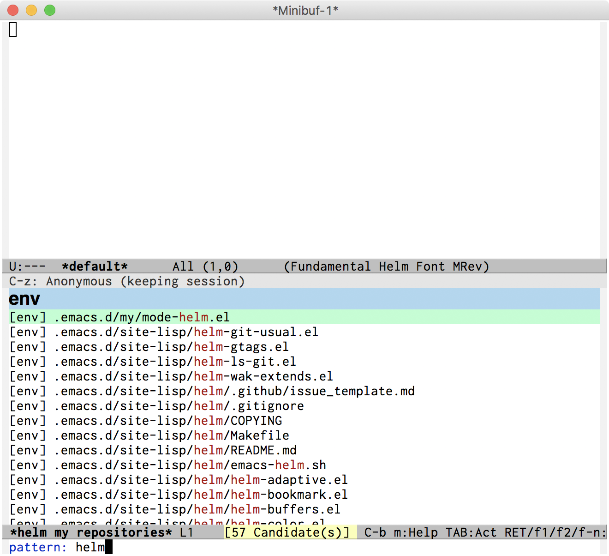

# helm-git-usual
A [Helm](https://github.com/emacs-helm/helm) plug-in which list your git repositories that frequently used.

## Overview
helm-git-usualは、特定のGitリポジトリのファイルを開くためのHelmプラグインです。

いつも特定のGitリポジトリをよく使う場合に使用すると便利です。

私の場合は、ホームディレクトリ以下の各種設定（.zshrcなど）や、メモ集をGitリポジトリに詰め込んであるので、helm-git-usualで開いて使っています。




## 使い方
### 設定
Emacsの設定に、以下のように設定を記述します。

```elisp
(require 'helm-git-usual)
(setq helm-git-usual-repositories '(("env" . "~/")
                                    ("tips" . "~/work/tips")))
```

この例では、ホームディレクトリのGitリポジトリ（~\/）と、メモ集のGitリポジトリ（~\/work\/tips）を登録しています。

envやtipsという文字列は、任意です。Helmの候補一覧の分類分けに使用されます。

### 起動
起動するためには、helm-git-usual関数を実行してください。

一度実行すると、ファイル一覧をメモリ上にキャッシュするので、Gitリポジトリのファイルを追加等された場合は、helm-git-usual-clear関数を実行してキャッシュを削除してください。
